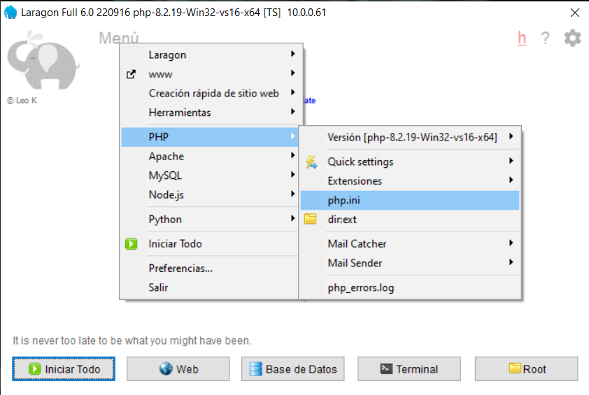
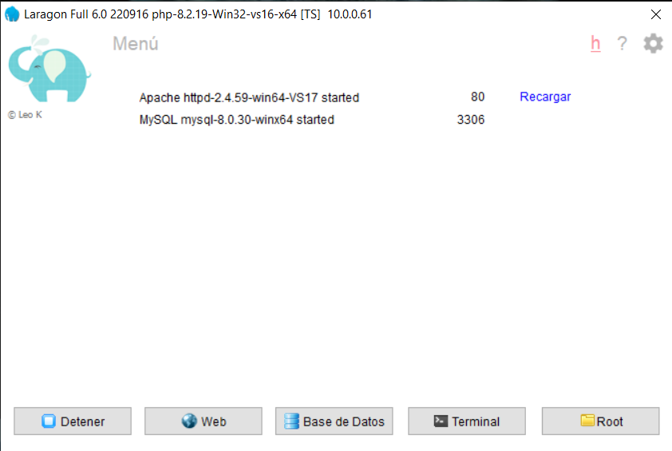
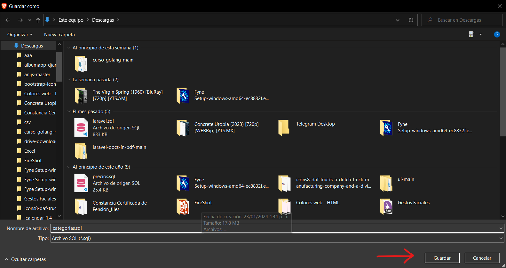
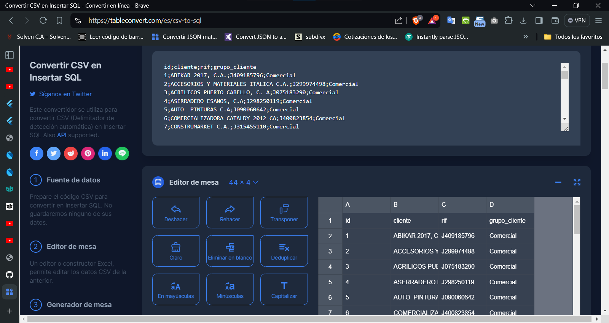
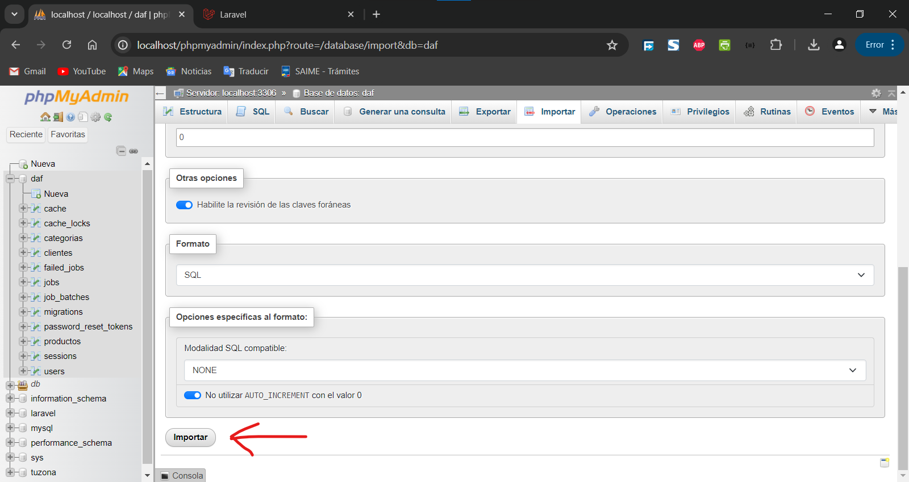

## Acerca de Laravel

Laravel es un marco de aplicación web con una sintaxis elegante y expresiva. Creemos que el desarrollo debe ser una experiencia agradable y creativa para que sea verdaderamente satisfactorio. Laravel elimina las complicaciones del desarrollo al facilitar las tareas comunes utilizadas en muchos proyectos web, como por ejemplo:

- [Simple, fast routing engine](https://laravel.com/docs/routing).
- [Powerful dependency injection container](https://laravel.com/docs/container).
- Multiple back-ends for [session](https://laravel.com/docs/session) and [cache](https://laravel.com/docs/cache) storage.
- Expressive, intuitive [database ORM](https://laravel.com/docs/eloquent).
- Database agnostic [schema migrations](https://laravel.com/docs/migrations).
- [Robust background job processing](https://laravel.com/docs/queues).
- [Real-time event broadcasting](https://laravel.com/docs/broadcasting).

Laravel es accesible, potente y proporciona las herramientas necesarias para aplicaciones grandes y sólidas.

## Aprendiendo Laravel

Laravel tiene el más extensa y completa [documentation](https://laravel.com/docs) y una biblioteca de tutoriales en vídeo de todos los marcos de aplicaciones web modernos, lo que facilita el inicio del marco.

También puedes probar el [Laravel Bootcamp](https://bootcamp.laravel.com), donde se le guiará en la creación de una aplicación Laravel moderna desde cero.

Si no tienes ganas de leer, [Laracasts](https://laracasts.com) puede obtener ayuda. Laracasts contiene miles de tutoriales en vídeo sobre una variedad de temas que incluyen Laravel, PHP moderno, pruebas unitarias y JavaScript. Mejore sus habilidades investigando nuestra completa biblioteca de videos.

## Patrocinadores Laravel

Nos gustaría extender nuestro agradecimiento a los siguientes patrocinadores por financiar el desarrollo de Laravel. Si está interesado en convertirse en patrocinador, visite el [Laravel Partners program](https://partners.laravel.com).

### Socios Premium

- **[Vehikl](https://vehikl.com/)**
- **[Tighten Co.](https://tighten.co)**
- **[WebReinvent](https://webreinvent.com/)**
- **[Kirschbaum Development Group](https://kirschbaumdevelopment.com)**
- **[64 Robots](https://64robots.com)**
- **[Curotec](https://www.curotec.com/services/technologies/laravel/)**
- **[Cyber-Duck](https://cyber-duck.co.uk)**
- **[DevSquad](https://devsquad.com/hire-laravel-developers)**
- **[Jump24](https://jump24.co.uk)**
- **[Redberry](https://redberry.international/laravel/)**
- **[Active Logic](https://activelogic.com)**
- **[byte5](https://byte5.de)**
- **[OP.GG](https://op.gg)**

## Contribuyendo

¡Gracias por considerar contribuir al marco de Laravel! La guía de contribución se puede encontrar en el [Laravel documentation](https://laravel.com/docs/contributions).

## Código de conducta

Código de conducta Para garantizar que la comunidad de Laravel sea acogedora para todos, revise y respete el [Code of Conduct](https://laravel.com/docs/contributions#code-of-conduct).

## Vulnerabilidades de seguridad

Si descubre una vulnerabilidad de seguridad dentro de Laravel, envíe un correo electrónico a Taylor Otwell a través de [taylor@laravel.com](mailto:taylor@laravel.com). Todas las vulnerabilidades de seguridad se abordarán de inmediato.

## Licencia

El framework Laravel es un software de código abierto con licencia bajo la [MIT license](https://opensource.org/licenses/MIT).

## Pantallas del proyecto DAE

- [Página Web para Convertir CSV en SQL](https://tableconvert.com/es/csv-to-sql)

